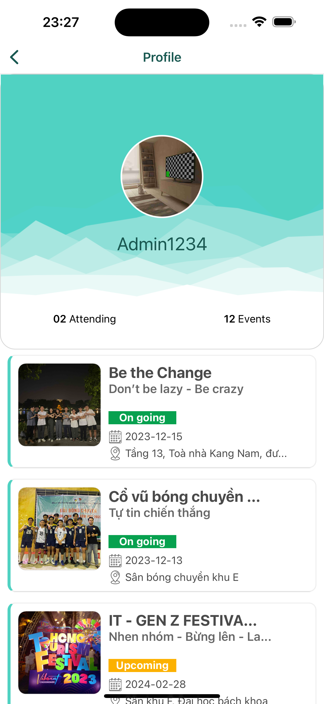

# HighX5 Event Management Application

## Mobile 
### Project Information


### Scripts

- `start`: Start the project using Expo.
- `android`: Start the project for Android.
- `ios`: Start the project for iOS.
- `web`: Start the project for web.
- `fakeApi`: Start a fake API server using json-server.

### Running the App
1. Install dependencies:
```bash
   cd frontend
   npm install
```
2. Start the development server Expo:
```bash
    npm start
```
3. For Android:
```bash
    npm run android
```
4. For iOS:
```bash
    npm run ios
```


---

## Backend
### Project Information


### Scripts

- `test`: Run tests (placeholder).
- `start`: Start the server using Nodemon.


### Getting Started

1. Install dependencies:
```bash
    cd backend
    npm install
```
2. Set up your environment variables:
- Create a .env file in the backend directory.
- Add the required environment variables
3. Start the server using Nodemon:
```bash
    npm start
```
---
## Demo UI 
{ width=33% height=33% }
{ width=33% height=33% }
{ width=33% height=33% }
{ width=33% height=33% }
{ width=33% height=33% }
{ width=33% height=33% }
{ width=33% height=33% }
{ width=33% height=33% }
{ width=33% height=33% }
{ width=33% height=33% }
{ width=33% height=33% }
{ width=33% height=33% }
{ width=33% height=33% }
{ width=33% height=33% }

